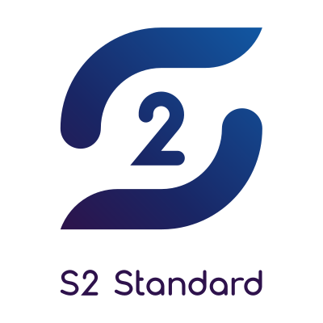

# Documentation for the S2 standard
<div align="center">
    <a href="https://s2standard.org"></a>
</div>
<br />

See the live version at [docs.s2standard.org](https://docs.s2standard.org).

This repository contains the source code for the documentation website of the S2 standard. Additionally, it includes the structured documentation from which the data model reference is generated. 

> The structured documentation serves as the single source of truth for other places where the data model is documented, such as in the S2-Rust library.


## Workflow

### Document the data model
The documentation in `structured-documentation` is the starting point for the documentation of the data model in toml format. The documentation has to be extended manually.

### Generate Markdown for data model reference
The data model reference is created directly from the structured-documentation. Since Docusaurus allows for Markdown-based documentation, the tool in `website-generator` takes the structured documentation and generates Markdown files for them, which are placed in `website/model-reference`. Please note that this folder is added to `.gitignore` because the Markdown files will be freshly created during the deployment. To run the data model markdown generation tool, you must have [installed the Rust toolchain](https://rust-lang.org/tools/install/), then run:

```bash
cd website-generator
cargo run --release
```

### Write documentation for S2
The `website` directory contains the file that make up the actual documentation website. Please find in the `website/docs` directory all the Markdown files that constitute the documentation of the S2 standard. The convention is to follow pretty URL patterns (i.e. kebab-case) for the directories and filenames because Docusaurus uses those names to create URLs to the pages (and we want pretty URLs, of course).

### Running the documentation development server
Docusaurus comes with a development server with hot-code replacement. To build the documentation website and to run the development server locally, make sure to have nodejs (v22 or higher) installed, and run from the `website` directory:

```bash
npm run start
```

Sometimes it is needed to clear the build cache in case there are errors displayed on the development website:

```bash
npm run clear
```


### Deployment
The documentation website is deployed to GitHub pages with GitHub actions. Every time a branch is merged to master, the website is automatically deployed 🚀

## Technical details
The documentation website is created by means of [docusaurus.io](https://docusaurus.io/), that leverages React to create powerful websites but also allows for easy-to-write Markdown-based documentation. "This project uses the default styling theme of Docusaurus that uses [infima](https://infima.dev/). So if you want to style something on the main page, please refer to the infima docs.