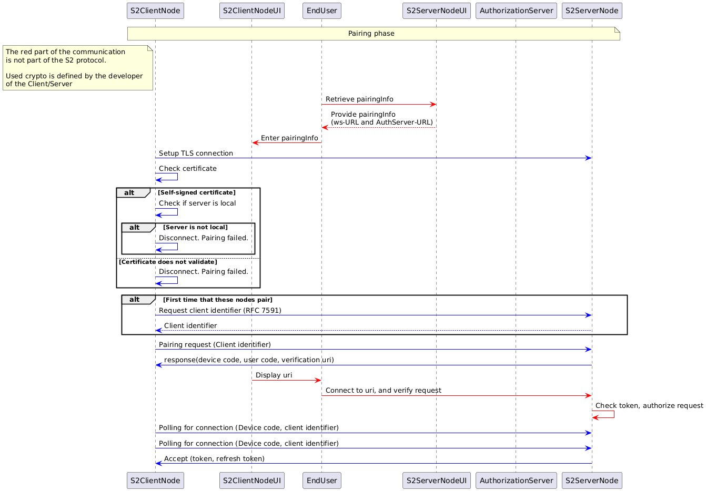

Since oAuth 2.0 is the industry standard to authenticate clients for accessing protected server resources, it is very reasonable to question why the authorization of S2 clients is not using OAuth 2.0.

Given our requirements on the pairing and authentication process, the following RFCs are needed to base the authentication on Oauth 2.0:

* OAuth 2.0 Framework (RFC 6749)
* Device Authorization Grant (RFC 8628), this allows supporting S2 clients with very a limited user interface.
* Dynamic Client Registration Protocol (RFC 7591), this is needed because we don't want to preconfigure clients at the authorization server.

The pairing and authentication process based on OAuth 2.0 would be specified as follows:


<details>
<summary>Image generated using the following PlantUML code:</summary>

```
@startuml
participant S2ClientNode
participant S2ClientNodeUI
participant EndUser
participant S2ServerNodeUI
participant AuthorizationServer
participant S2ServerNode

note over S2ClientNode, S2ServerNode : Pairing phase
note left of S2ClientNode: The red part of the communication \nis not part of the S2 protocol. \n\nUsed crypto is defined by the developer \nof the Client/Server


'PRE-OAUTH communication
EndUser -[#red]> S2ServerNodeUI: Retrieve pairingInfo
S2ServerNodeUI --[#red]> EndUser: Provide pairingInfo \n(ws-URL and AuthServer-URL)
EndUser -[#red]> S2ClientNodeUI: Enter pairingInfo

S2ClientNode-[#blue]> S2ServerNode : Setup TLS connection
S2ClientNode-[#blue]> S2ClientNode: Check certificate
alt Self-signed certificate
S2ClientNode-[#blue]> S2ClientNode: Check if server is local
alt Server is not local
S2ClientNode-[#blue]> S2ClientNode: Disconnect. Pairing failed.
end
else Certificate does not validate
S2ClientNode-[#blue]> S2ClientNode: Disconnect. Pairing failed.
end

'Pairing with server
alt First time that these nodes pair
S2ClientNode-[#blue]> S2ServerNode : Request client identifier (RFC 7591)
S2ServerNode--[#blue]> S2ClientNode: Client identifier
end


S2ClientNode-[#blue]> S2ServerNode : Pairing request (Client identifier)
S2ServerNode -[#blue]> S2ClientNode: response(device code, user code, verification uri)


S2ClientNodeUI-[#red]>EndUser: Display uri
EndUser-[#red]>S2ServerNode: Connect to uri, and verify request
S2ServerNode-[#red]>S2ServerNode: Check token, authorize request


S2ClientNode-[#blue]> S2ServerNode : Polling for connection (Device code, client identifier)
S2ClientNode-[#blue]> S2ServerNode : Polling for connection (Device code, client identifier)
S2ServerNode -[#blue]> S2ClientNode: Accept (token, refresh token)
@enduml
```

</details>


Let's break that down:

The process starts with an end user who wants to pair two S2 nodes. The end user goes to the S2ServerNodeUI to retrieve the following URLs:
- Authentication server URL
- Websocket server URL

Note that some of these urls could be composed by only communicating a base URL and specifying on which paths the different servers are located, which would reduce amount of URLs that the end user needs to enter in the S2ClientNodeUi.

In addition, the end users receives an device code that is needed for the OAuth 2.0 device flow grant.

Next, the S2ClientNode sets up a TLS connection to the authorization server.

If it's the first time that the S2ClientNode wants access to a specific server, then follows a dynamic client registration (according to [RFC 7591](https://datatracker.ietf.org/doc/html/rfc7591)). This is needed because one of the requirements of the S2 pairing process is that the client and server cannot have any knowledge about each other. This guarantees interoperability because it allows for any S2 client to be able to connect to any S2 server without a developer that needs to request a client identifier (and possible a client secret) and use that in the client application for a specific server.

Please note that dynamic client registration is not very common and has also security risks that need to be mitigated which means that using 'standard OAuth 2.0' is not so standard in this context.

After client registration, the S2ClientNode requests an access code following the device authorization grant specification ([RFC 8628](https://www.rfc-editor.org/rfc/rfc8628)), again over a TLS connection to the authorization server.

This token would then be used in the authorization header when making a websocket connection.


## Why not using OAuth 2.0?

While we have specified the way how OAuth 2.0 can be used for authorizing S2 clients, there are several reasons why we favor our own protocol:
* Using OAuth 2.0 will require the end user to enter more information from S2ServerNodeUI to the S2ClientNodeUI compared to our custom pairing specification. The user has to provide the Authentication server URL, the Resource Server URL, the Websocket URL, and copy the token to S2ClientUI.
* The required functionality of OAuth 2.0 is separated in three different RFC's. This shows that this functionality is not part of the OAuth 2.0 core. Using OAuth 2.0 would limit OAuth 2.0 libraries that implement all three RFC's or still require manual implementation of .
* Since S2 would use such a specific use case in OAuth2.0, it's unknown how future proof this use case is. It's unknown if this use case will still be available in OAuth 3.0.
* The communication layer of S2 specifies the use of websockets. OAuth 2.0 does not have a (out of the box) solution for communicating to the client where the websocket connection should be opened. Hence, this requires the end user to manually configure the websocket URL on the client.
* S2 requires the protocol to be usable in a local situation, without internet connection. S2 does accept self-signed certificates in these specific situations. OAuth2.0 is not clear about this situation. As a result it is not clear whether it's possible to use OAuth 2.0 in this situation.
* In addition, to support the local-local scenario, the S2ServerNode needs to run the authorization server locally as well. Such a server is not necessarily the most resource intensive application but still requires the server to be packed with extra code.


## Alternative OAuth 2.0 grants 

Below are listed other OAuth 2.0 grant types and we briefly explain why those are not suitable for this purpose.

**Authorization Code**

The Authorization Code grant type is used to exchange an authorization code in order to get an access token. This type relies on a client being redirected via a URL in the browser. For S2, S2 nodes need to communicate directly and we can't therefore rely on a an end user's browser.

https://tools.ietf.org/html/rfc6749#section-1.3.1

**Proof Key for Code Exchange (PKCE)**

PKCE is an extension to the Authorization Code grant type with improved security features. However the same limitation around browser redirects apply.

www.rfc-editor.org/rfc/rfc7636

**Client Credentials**

The Client Credentials grant type is generally recommended for machine to machine communication. It relies un using a client id and client secret that the server knows about in other to authenticate. It is required that the client can keep a secret and that the server knows about this secret. In the S2 scenario any CEM and RM need to be able to communicate. It's thus not possible to agree on a client id and secret in advance, while being able to guarantee that this remains a secret. Distributing the information with the S2 node acting as a server, for example for the end user to fill in, would mean that it can't be kept secret.

[tools.ietf.org/html/rfc6749#section-4.4](https://datatracker.ietf.org/doc/html/rfc6749#section-4.4)


**Refresh Token**

The Refresh Token grant type is not really a separate grant type, but is a way to obtain a new token once the existing token has expired.

[tools.ietf.org/html/rfc6749#section-1.5](https://datatracker.ietf.org/doc/html/rfc6749#section-1.5)