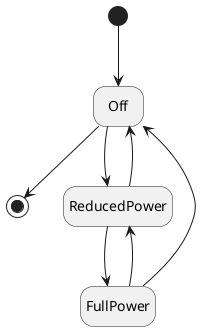

# Operation Mode based Control Types

## Similarities
There are three Control Types that are based on a common principle of _Operation Modes_. There three Control Types are:

* Operation Mode Based Control (OMBC)
* Fill Rate Based Control (FRBC)
* Demand Driven Based Control (DDBC)

Although these Control Types differ enough to separate them into three distinct Control Types, there are some common aspects that make them similar: Operation Modes, Transitions and Timers. These concepts are explained on this page.

## A virtual device
The objective for a Control Type is basically for a CEM to understand what a device is capable of from an energy perspective, under which circumstances what things can be adjusted, and what the constraints are for these adjustments. And for many applications it is important that the CEM can make relatively good predictions of what will happen in certain situations. The three Operation Mode based Control Types do that in similar fashion: they model a *virtual, abstract device*.

Of course, in the end, it is all about controlling the *real, physical device*. But the virtual device is a helpful tool. The physical device contains a lot of details that are not relevant for a CEM. The control system of the physical device has all sorts of concerns, but the CEM is only concerned with utilizing energy flexibility. The virtual device ignores all details of the device that are not relevant to a CEM. In addition, physical devices have an enormous variety in parameters, sensors, control strategies, concerns, safeguards, and so on. It would be practically impossible to develop a CEM that can understand all the parameters of all the physical devices on the market. By making the virtual device more abstract, its concepts can be translated to all sorts of physical devices, even though internally they function very differently. As a consequence, it not always possible to make a 100% accurate description of all the behaviors and constraints in these abstractions. But the abstractions used in the control types are quite powerful, and should allow you to come pretty close.

The Control Types basically define how the virtual device can be described. It is the job of the RM to describe the behavior of the physical device as well as it can, in the terms of the virtual device. The RM describes how the virtual device functions, what it can do and what kind of constraints it has. It also informs the CEM about the current state of the virtual device. Based on the description of this virtual device, the CEM can make predictions of that the virtual device will do in certain situations, and when it is allowed to send which instruction to the RM. When the CEM sends an instruction for the virtual device to the RM, it is the job of RM to translate this instruction for the virtual device into an instruction to the physical device that would yield the same result. Once the physical device has changed it behavior, the RM should inform the CEM that the virtual device has changed its state accordingly.

## State machine
The system of Operation Modes is basically based on the idea of a state machine. A state machine is a concept where there any several possible states to be in, but at any point in time there can be only one active state. The state machine can go to another state only if there exists a transition from the current active state to the next one.

For example, see the simple example below:


<details>



</details>

A state machine always starts with the black circle, and ends with the white circle with the black circle in it. In this example you start in the state "Off". From there you can go to the state "ReducedPower", but not directly to "FullPower", since there is no transition from "Off" to "FullPower". In other words, you have to go through "ReducedPower" if you want to go to "FullPower".

| Current state | Allowed next states |
|---------------|---------------------|
| Off           | ReducedPower        |
| ReducedPower  | Off, FullPower      |
| FullPower     | ReducedPower, Off   |

Within S2, Operation Modes are basically the states from the state machine. There can be only one Operation Mode active at a certain point in time. (Note: With FRBC and DDBC you could have multiple Actuators, which each have their own state machine. So for FRBC and DDBC, there is always one active Operation Mode for each Actuator). Each Operation Mode and Transition has certain information associated with it to inform the CEM about the behavior of the device.

Other than the typical state machine, Operation Modes don't have a start and end node, since the operation of a device is basically an ongoing process. When a Control Type is activated, you just start with whatever Operation Mode is currently active on the device. The RM tells the CEM which Operation Modes and Transitions exist. The RM informs the CEM about the active Operation Mode, and immediately notifies the CEM when the Operation Mode changes. The CEM can make a request (through an Instructions message) to make another Operation Mode active, but in the end it is always the RM (or the physical device) that decides which Operation Mode is active. Although not preferable, a RM can activate another Operation Mode without the CEM requesting it, and it is even allowed to activate an Operation Mode even if there is no transition from the old one to the new one.

## Operation Modes
Although the exact properties of the Operation Modes differ for the different Control Types, they all share some properties:

| Property | Description |
| -------- | ----------- |
| id | Unique identifier for the Operation Mode (UUID) |
| diagnostic_label | Human-readable description of the Operation Mode (for debugging purposes) |
| power_ranges | The power exchanged with the grid when this Operation Mode is active |
| running_costs | [Costs](https://github.com/flexiblepower/s2-ws-json/wiki/Common_concepts#costs-running-costs-and-transition-costs) associated with running this operation mode (not including energy costs) |
| abnormal_condition_only | If this Operation Mode is only to be used during [abnormal conditions](https://github.com/flexiblepower/s2-ws-json/wiki/Common_concepts#abnormal-condition) |

Note: For more details, see the data structure reference for [OMBC](https://github.com/flexiblepower/s2-ws-json/wiki/OMBC_messages#ombcoperationmode), 
[FRBC](https://github.com/flexiblepower/s2-ws-json/wiki/FRBC_messages#frbcoperationmode) or [DDBC](https://github.com/flexiblepower/s2-ws-json/wiki/DDBC_messages#ddbcoperationmode).

### Power

The most important property here is the `power_range`, which informs the CEM what the [power](https://github.com/flexiblepower/s2-ws-json/wiki/Common_concepts#power) production or consumption is when the Operation Mode is active. Assuming that we use a [CommodityQuantity](https://github.com/flexiblepower/s2-ws-json/wiki/Common_concepts#commodityquantity) for electricity, the Operation Modes of the previous example could be defined such that Off consumes 0 Watts, ReducedPower consumes 1000 Watts and FullPower consumes 2500 Watts. By associating this information with the Operation Mode, the CEM knows what to expect when it requests the device to go to a certain Operation Mode.

| Property | | | |
| --- | --- | --- | --- |
| id | f3f... | 24b... | ca5... |
| diagnostic_label | Off | ReducedPower | FullPower |
| power | 0 Watts | 1000 Watts | 2500 Watts |


### Operation Mode Factor
As you might have noticed, describing the power consumption or production of a device using Operation Modes, forces us to pick discrete power values. But what if we have a device that allows you to pick any power value? Imagine our example device, which only has two modes: Off, where it consumes 0 Watts, and On, where it can consume any amount of power between 1000 and 2500 Watts. How would you describe the behavior of the second mode as S2 Operation Modes?

One possibility is to just split up the range between 1000 and 2500 Watts in discrete steps, and define a whole list of Operation Modes for each discrete value. For example, when picking steps of 100 Watts, you would create one for 1000 Watts, on for 1100 Watts, one for 1200 Watts... all the way up until 2500. Doing so would result in a total of 17 Operation Modes, and we loose the precision of picking values that aren't exactly rounded to a multiple of 100. Although in some cases it might be desirable to pick discrete values, S2 offers another solution.

When taking a closer look at the data model for Operation Modes, you might notice that the `power_range` property is actually... a range. It consists of two numbers: the start of the range and the end of the range. This allows you to cover the whole spectrum of power values the Operation Mode supports. However, when an Operation Mode only has one possible power value, the start and end of the range should just be equal to each other. This would simplify the Operation modes in our example:

| Property | | |
| --- | --- | --- |
| id | a29... | 48c... |
| diagnostic_label | Off | On |
| start power_range | 0 Watts | 1000 Watts |
| end power_range | 0 Watts | 2500 Watts |

But the CEM probably doesn't want to have any value within the range... it wants to specify exactly which value. This is where the Operation Mode factor comes into play. When requesting the RM to go to a certain Operation Mode, the CEM also needs to indicate which value within the range it wants. But instead of directly communicating a power value in Watts, the CEM communicates the factor. The factor is a (floating point) value between 0 and 1 indicating exactly where in the range it wants the value to be. When picking the factor 0 the power value is the start of the range, when picking the value 1 the power value is the end of the range. Values in between need to be linearly interpolated.

You could use the following formula to calculate the power value given the factor and the power range:

```power = (end power_range - start power_range) * factor + start power_range```

Alternatively, you could use the following formula to calculate the factor given the power value and the power range:

```factor = (power - start power_range) / (end power_range - start power_range)```

For example, when the factor is 0.5, the specified power value is (2500 - 1000) * 0.5 + 1000 = 1750 Watts.

| Factor | Power for Opertion Mode Off | Power for Opertion Mode On |
| --- | --- | --- |
| 0.0 | 0 Watts | 1000 Watts |
| 0.1 | 0 Watts | 1150 Watts |
| 0.2 | 0 Watts | 1300 Watts |
| 0.3 | 0 Watts | 1450 Watts |
| 0.4 | 0 Watts | 1600 Watts |
| 0.5 | 0 Watts | 1750 Watts |
| 0.6 | 0 Watts | 1900 Watts |
| 0.7 | 0 Watts | 2050 Watts |
| 0.8 | 0 Watts | 2200 Watts |
| 0.9 | 0 Watts | 2350 Watts |
| 1.0 | 0 Watts | 2500 Watts |

As you can see, when the start and end of the power_range are identical, the specified power value is always the same, regardless of the factor. This means that when an Operation Mode has the same value for the start and end of the range, it doesn't matter which factor the CEM provides in its request.

As we've discussed, the CEM can send a request to the RM to go to a certain Operation Mode. The CEM must also always specify the factor it wants that Operation Mode to be in. A CEM is also always allowed to request the RM to go the same Operation Mode as the currently active on, but with a different factor. It is not necessary for the RM to define a Transition from that Operation Mode to itself to do so (which is usually the case for state machines). 

### Running costs
Optionally, a RM can specify running costs being in a certain operation mode, e.g. due to wear to the device (see [Costs](https://github.com/flexiblepower/s2-ws-json/wiki/Common_concepts#costs-running-costs-and-transition-costs) for more details). The value specified is the costs in the Currency as defined in the [ResourceManagerDetails](https://github.com/flexiblepower/s2-ws-json/wiki/Common_messages#resourcemanagerdetails) message per second (which is usually a very small number). The running costs are expressed as a range, but be aware that this range indicates uncertainty, and is not linked to the factor like the power_range! When there is uncertainty about the exact costs or it cannot be exactly described (e.g. because it is not directly related to the time spent within this operation mode), the range is used to express that the costs are somewhere within that range. The RM cannot provide any additional information on where in that range it expects the costs to be. If there is no uncertainty in the costs, the RM can simply provide the same value for the start and end of the range.

## Transitions
TODO

## Timers
TODO