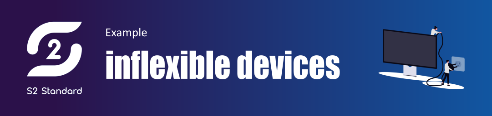
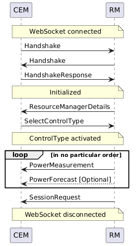

This page serves as a guide for implementing an S2 RM for a non-flexible device, or to give a CEM developer a better understanding of what to expect when taking into account information from non-flexible device. It provides some example S2 messages for same (fictional) non-flexible devices. Some examples of non-flexible devices are a TV, an electric cooking appliance, lights and a non-curtailable PV system.

## Example: Non controllable assets

In this example we will work out the communication between CEM and RM for a non-controllable asset. The RM will provide the CEM with a power forecast and real time power measurements, but the CEM will not be able to control the asset in any way.

The following sequence diagram is an example of what a message exchange between a CEM and RM could look like, but messages could also be sent in a different order (see also [State of communication](/docs/communication-layer/discovery-pairing-authentication/#state-of-communication)). `ReceptionStatus` messages are omitted for readability.


<details>

Image generated using the following PlantUML code:

```
@startuml

note over CEM, RM: WebSocket connected

CEM -> RM: Handshake
RM -> CEM: Handshake
CEM -> RM: HandshakeResponse

note over CEM, RM: Initialized

RM -> CEM: ResourceManagerDetails
CEM -> RM: SelectControlType

note over CEM, RM: ControlType activated

loop in no particular order
RM -> CEM: PowerMeasurement
RM --> CEM: PowerForecast [Optional]

end loop

RM -> CEM: SessionRequest

note over CEM, RM: WebSocket disconnected

@enduml
```

</details>

### CEM -> RM: Handshake
The CEM informs the RM that it is a CEM and which versions of s2-ws-json it supports.
```json
{
  "message_type": "Handshake",
  "message_id": "4834583e-5d8a-4fb2-a955-c99fc4583b7a",
  "role": "CEM",
  "supported_protocol_versions": [
    "0.0.2-beta"
  ]
}
```

### RM -> CEM: Handshake
The RM informs the CEM that it is a RM and which versions of s2-ws-json it supports.
```json
{
  "message_type": "Handshake",
  "message_id": "a377dfd9-48b3-42a4-89c3-2c99c4824458",
  "role": "RM",
  "supported_protocol_versions": [
    "0.0.2-beta"
  ]
}
```

### CEM -> RM: HandshakeResponse
The CEM informs the RM which version of s2-ws-json it has selected for this session.
```json
{
  "message_type": "HandshakeResponse",
  "message_id": "7b0943cb-9b8d-45dc-bd80-83c20b4371ef",
  "selected_protocol_version": "0.0.2-beta"
}
```

### RM -> CEM: ResourceManagerDetails
The RM informs the CEM about several static properties of the asset:
* The resource_id is a unique string in the context of the CEM.
* The name is a default name or user defined name (when possible) for UI purposes.
* This asset does not define any costs related parameters, so no currency needs to be provided.
* This RM only implements the `NOT_CONTROLABLE` Control Type.
* This RM does provide power forecasts.
* For this example, a single phase electric device (when there is only one phase the phase L1 must be used) is presented, so it will only provide measurements for the single phase. For three-phase assets, all phases should be listed here (and for each phase measurements should be provided), or in the case the three-phase power is symmetric and therefore equally shared over all phases, `ELECTRIC.POWER.3_PHASE_SYMMETRIC` could be used here.
```json
{
  "message_type": "ResourceManagerDetails",
  "message_id": "ab44046a-2bd2-4115-b16c-985638166afa",
  "resource_id": "acme_asset",
  "name": "my_asset",
  "roles": [
    {
      "role": "ENERGY_CONSUMER",
      "commodity": "ELECTRICITY"
    }
  ],
  "manufacturer": "ACME",
  "model": "Asset-3000",
  "serial_number": "123",
  "firmware_version": "v1.0",
  "instruction_processing_delay": 10000,
  "available_control_types": [
    "NOT_CONTROLABLE"
  ],
  "provides_forecast": true,
  "provides_power_measurement_types": [
    "ELECTRIC.POWER.L1"
  ]
}
```

### CEM -> RM: SelectControlType
The CEM informs the RM that it wants to use `NOT_CONTROLABLE` ControlType (the RM defined in the ResourceManagerDetails that this is the only supported ControlType).
```json
{
  "message_type": "SelectControlType",
  "message_id": "695b0a6c-1d0e-4ad3-803f-21288ad5f76b",
  "control_type": "NOT_CONTROLABLE"
}
```

### RM -> CEM: PowerMeasurement
The RM sends power measurements to the CEM using the PowerMeasurement message. It can send multiple values with the same timestamp (e.g. for three-phase measurements). For our example only one phase is used.

```json
{
  "message_type": "PowerMeasurement",
  "message_id": "6652c78e-57c8-4e04-807f-685b6b3fde17",
  "measurement_timestamp": "2019-08-24T14:15:22Z",
  "values": [
    {
      "commodity_quantity": "ELECTRIC.POWER.L1",
      "value": 3450.6
    }
  ]
}
```

### RM -> CEM: PowerForecast
It can be quite useful for a CEM to know in advance what the future energy usage of a device will be. This is true for both controllable and non-controllable devices. Such a forecast can be used by an energy management algorithm to establish the base load it will have to work with. The data for this power forecast could for example be retrieved from a weather service that can calculate this forecast based the location and orientation of the asset. A PowerForcast can also incorporate uncertainty of the forecast in the values.

```json
{
  "message_type": "PowerForecast",
  "message_id": "bde674ac-66ef-4fed-8b12-d01b8404e10d",
  "start_time": "2024-08-24T14:00:00Z",
  "elements": [
    {
      "duration": 3600000,
      "power_values": [
        {
          "value_upper_limit": 3500.0,
          "value_upper_95PPR": 3460.0,
          "value_upper_68PPR": 3455.0,
          "value_expected": 3450.1,
          "value_lower_68PPR": -3445.0,
          "value_lower_95PPR": -3440.0,
          "value_lower_limit": -3400.0,
          "commodity_quantity": "ELECTRIC.POWER.L1"
        }
      ]
    }
  ]
}
```


### RM -> CEM, CEM -> RM: SessionRequest
Both the RM and the CEM can send a connection life cycle management message, i.e. a SessionRequest message in order to let the other side know to gracefully shut down and if there is a request for a reconnect.

```json
{
  "message_type": "SessionRequest",
  "message_id": "1d509406-816c-4ce3-a034-ce88a684116c",
  "request": "TERMINATE",
  "diagnostic_label": "string"
}
```
