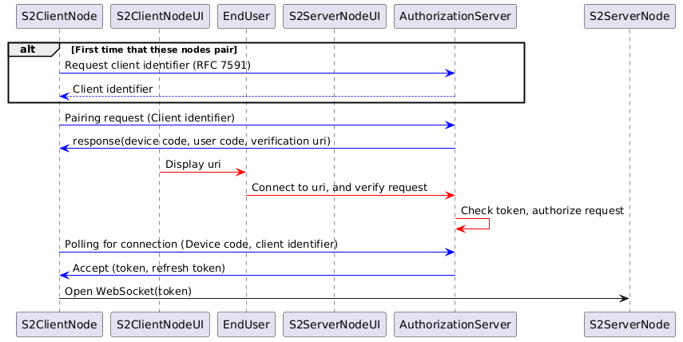

Since OAuth 2.0 is the industry standard to authorize clients for accessing protected server resources, it is very reasonable to question why the authorization of S2 clients do not use OAuth 2.0. This chapter addresses that question.

OAuth 2.0 is designed for delegated authorization, typically between a known client and a known authorization server in a centralized trust model. That is fundamentally different from the S2 Connect pairing requirements which require symmetric peer-to-peer-style pairing between CEM and RM, that have no prior trust or registration, need to work in LAN, WAN, and hybrid deployments and needs mutual authentication. The scope of OAuth 2.0 has only partial overlap with the scope of S2 Connect, which means that further specifications for, e.g. discovery are needed (not to mention that it would also be needed to specify _how_ to use OAuth 2.0 because is consists of a set of modular RFCs that must be combined for this use case). But the main objection is that it is not a good fit given the requirements for S2 Connect. We'll demonstrate that by detailing out how OAuth 2.0 could be used as part of the pairing process.

Given the requirements of the pairing and authentication process, at least the following OAuth 2.0 RFCs are needed:

* OAuth 2.0 Framework (RFC 6749)
* Device Authorization Grant (RFC 8628), this allows supporting S2 clients with very a limited user interface.
* Dynamic Client Registration Protocol (RFC 7591), this is needed to avoid preconfiguration of clients at the authorization server.

Furthermore, it is likely that 'Proof Key for Code Exchange by OAuth Public Clients' (RFC 7636) is needed as well because it allows for public clients (which would be a CEM of RM running on local device) to authorize more securely. Also, Token Revocation (RFC 7009) is probably needed in case of unpairing.

## Pairing based on OAuth 2.0
The pairing and authentication process based on OAuth 2.0 would be specified as follows:

After the discovery (or because of the end user has manually entered an URL) of the endpoint where a RM or CEM want to pair with, the pairing client is provisioned with:
- Authentication server URL
- Websocket server URL

OAuth 2.0 does not provide a means for discovery, so up to this point there is no difference between pairing based on OAuth 2.0 or a custom solution.

If it's the first time that the client wants authorize at that authorization server, then follows a dynamic client registration (according to [RFC 7591](https://datatracker.ietf.org/doc/html/rfc7591)). This is needed because one of the requirements of the S2 pairing process is that the client and server cannot have prior knowledge about each other. This guarantees interoperability because it allows for any S2 client to be able to connect to any S2 server without a developer that needs to request a client identifier (and possible a client secret) and use that in the client application for a specific server.

In case of deployments where both the RM and CEM are both running in the cloud, the typical use of OAuth 2.0 with the authorization code grand flow or the PKCE grand flow can be used. If only one of the RM and CEM is running in the cloud and the other one is running locally, the PKCE or device code flow should be used.

The device code flow of OAuth 2.0 ([RFC 8628](https://www.rfc-editor.org/rfc/rfc8628)) is based on an out-of-band communication step where the user authenticates and is used for devices with very limited user interaction capabilities (e.g. the absence of a means to enter text). In order to allow the user to perform that step, it visits an authorization page on a secondary device (typically a smart phone). If the device has the capability to show a QR code, that will improve the UX, otherwise the user has to type in the URL of the authorization page where it needs to submit the device code and to enter the device code on that page.

The end result is that the client has an access token (and potentially an refresh token) that would be used to authenticate when establishing a WebSocket connection.


<details>
<summary>Image generated using the following PlantUML code:</summary>

```
@startuml
participant S2ClientNode
participant S2ClientNodeUI
participant EndUser
participant S2ServerNodeUI
participant AuthorizationServer
participant S2ServerNode


'Pairing with server
alt First time that these nodes pair
S2ClientNode-[#blue]> AuthorizationServer : Request client identifier (RFC 7591)
AuthorizationServer--[#blue]> S2ClientNode: Client identifier
end


S2ClientNode-[#blue]> AuthorizationServer : Pairing request (Client identifier)
AuthorizationServer -[#blue]> S2ClientNode: response(device code, user code, verification uri)


S2ClientNodeUI-[#red]>EndUser: Display uri
EndUser-[#red]>AuthorizationServer: Connect to uri, and verify request
AuthorizationServer-[#red]>AuthorizationServer: Check token, authorize request


S2ClientNode-[#blue]> AuthorizationServer : Polling for connection (Device code, client identifier)
AuthorizationServer -[#blue]> S2ClientNode: Accept (token, refresh token)

S2ClientNode -> S2ServerNode: Open WebSocket(token)

@enduml
```

</details>


## Why not using OAuth 2.0?

The process above reveals the following disadvantages of using OAuth 2.0 in this context:
* Dynamic client registration must be used to cater for OAuth applications in open ecosystems but it is very rare is such cases and has also security risks that need to be mitigated.
* Because the CEM and RM can either run in a LAN or in the WAN and the requirements state that the pairing experience should be similar regardless of the deployment, all CEMs and RMs need to provide an authorization server. This is in conflicts with the requirement that the local RM must be able to run on constraint hardware.
* The UX is worse in case of devices with limited user interaction possibilities because the end user needs to visit an authorization page on a secondary device.
* It is not possible to pair a device without a user interface.
* The required functionality of OAuth 2.0 is separated in at least four different RFC's. This is an intentional design decision of OAuth 2.0 (which seems to be regretted considering the discussion around OAuth 2.1) but results in a pairing specification that elaborates extensively on _how_ to use OAuth 2.0 in this context.
* Different deployment scenarios (RM/CEM deployed in WAN/LAN) and different user interface capabilities require different OAuth flows, leading to increased implementation complexity.

## Alternative OAuth 2.0 grants 

Below are listed other OAuth 2.0 grant types and we briefly explain why those are not completely suitable for this purpose.

**Authorization Code**

The Authorization Code grant type is used to exchange an authorization code in order to get an access token. This type relies on a client being redirected via a URL in the browser. For S2, S2 nodes need to communicate directly and we can't therefore rely on a an end user's browser.

https://tools.ietf.org/html/rfc6749#section-1.3.1

**Proof Key for Code Exchange (PKCE)**

PKCE is an extension to the Authorization Code grant type with improved security features. However the same limitation around browser redirects apply.

www.rfc-editor.org/rfc/rfc7636

**Client Credentials**

The Client Credentials grant type is generally recommended for machine to machine communication. It relies un using a client id and client secret that the server knows about in other to authenticate. It is required that the client can keep a secret and that the server knows about this secret. In the S2 scenario any CEM and RM need to be able to communicate. It's thus not possible to agree on a client id and secret in advance, while being able to guarantee that this remains a secret. Distributing the information with the S2 node acting as a server, for example for the end user to fill in, would mean that it can't be kept secret.

[tools.ietf.org/html/rfc6749#section-4.4](https://datatracker.ietf.org/doc/html/rfc6749#section-4.4)


**Refresh Token**

The Refresh Token grant type is not really a separate grant type, but is a way to obtain a new token once the existing token has expired.

[tools.ietf.org/html/rfc6749#section-1.5](https://datatracker.ietf.org/doc/html/rfc6749#section-1.5)